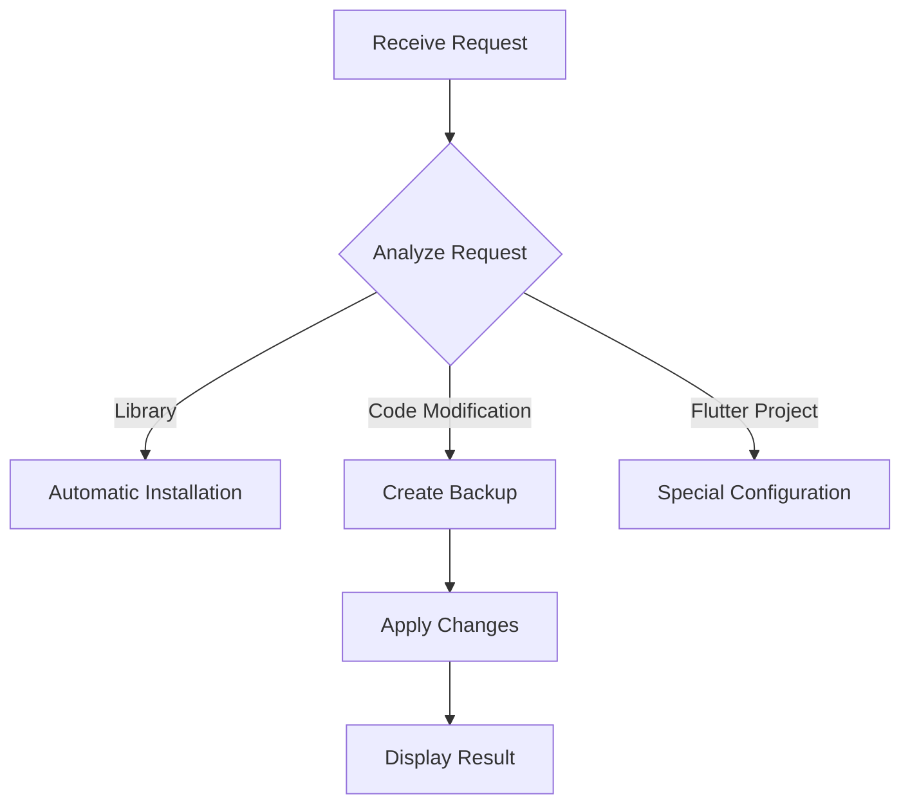
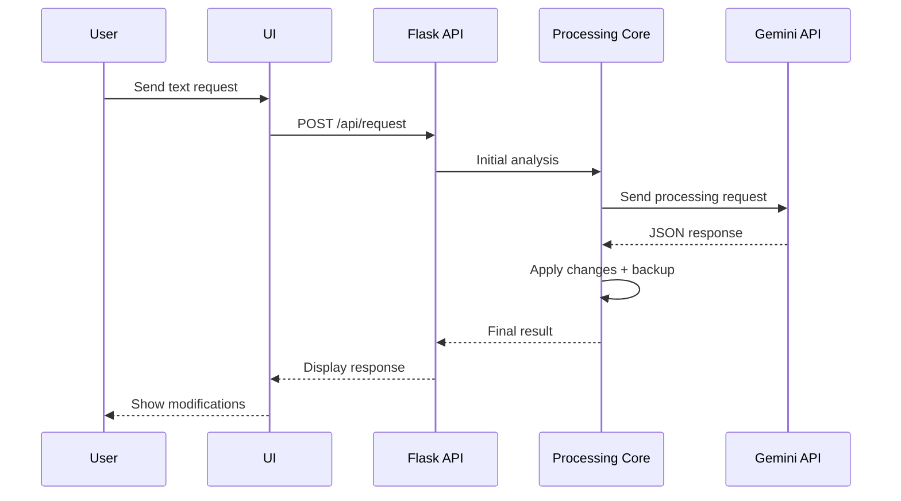
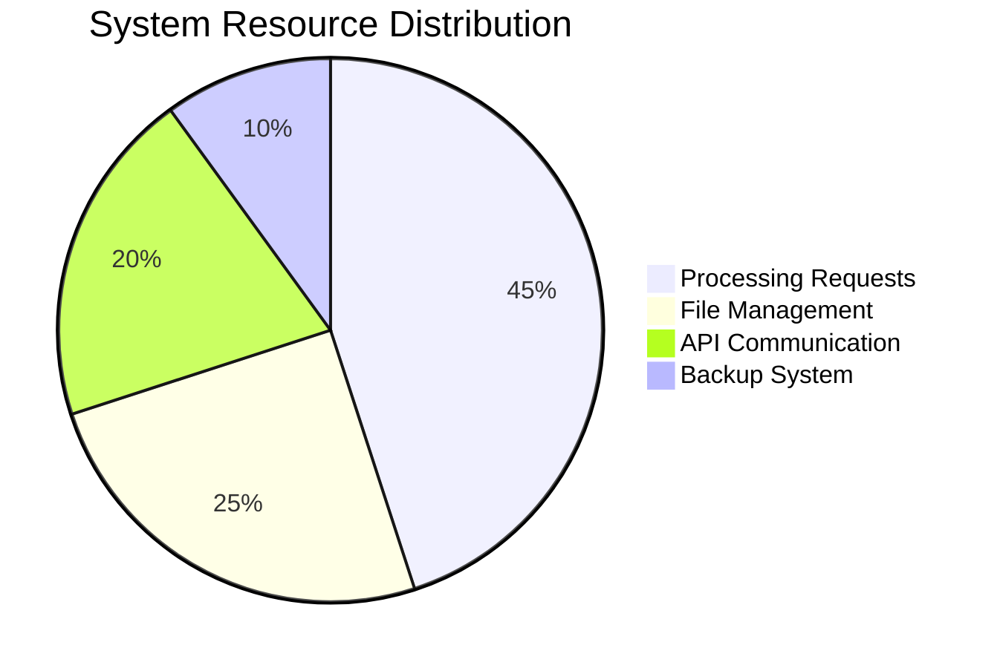
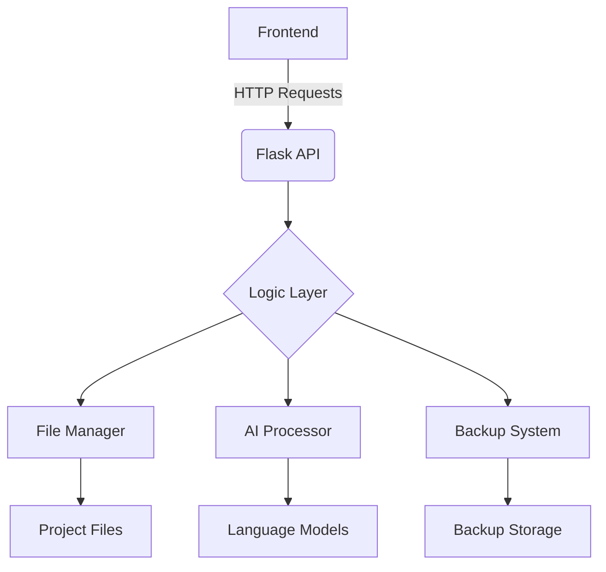

**مشاهده به فارسی:** [فارسی](https://github.com/ShoghShahadat/MahoAi/blob/main/README.md)

---

<!-- Banner Section -->
<div align="center">
  <h1>MahoAI 🤖 - Smart Programming Assistant</h1>
  <p>A powerful assistant to accelerate and enhance the software development process</p>
  <div>
    
    
    
  </div>
  
</div>

---

## 📚 Table of Contents
- [Project Introduction](#-project-introduction)
- [Key Capabilities](#-key-capabilities)
- [How It Works](#-how-it-works)
- [Core Features](#-core-features)
- [Project Structure](#-project-structure)
- [Installation & Setup](#-installation--setup)
- [Technical Details](#-technical-details)
- [Future Roadmap](#-future-roadmap)
- [Contributing](#-contributing)
- [Contact Us](#-contact-us)
- [File Descriptions](#-file-descriptions)

---

## ✨ Project Introduction
<div align="justify">
MahoAI is a smart programming assistant that transforms the software development process by integrating modern technologies. The system is designed with a dual Frontend/Backend architecture and offers advanced features such as accelerated coding, intelligent version management, automatic dependency installation, and support for Flutter projects.
</div>

🎯 **Key Goals**:
- ⚡ Accelerate the coding process
- 🛡️ Establish an intelligent version management system
- 📦 Automate dependency installation
- 🔄 Support Flutter projects

---

## 🚀 Key Capabilities
<div align="center">
  <table>
    <tr>
      <td width="33%">
        <h3>⚙️ Intelligent Processing</h3>
        <p>Analyzes requests with advanced language models</p>
      </td>
      <td width="33%">
        <h3>🔧 Project Management</h3>
        <p>Supports Python and Flutter projects</p>
      </td>
      <td width="33%">
        <h3>🔄 Version Control</h3>
        <p>Multi-stage backup system</p>
      </td>
    </tr>
  </table>
</div>

---

## 📖 How It Works
```bash
+------------------------+       +-----------------------+
|   User's Text Request  |  -->  |   Intelligent Process |
+------------------------+       +-----------------------+
                                        |
                                        v
+------------------------+       +-----------------------+
|  Automatic Code Update |  <--  | Gemini Language Model |
+------------------------+       +-----------------------+
```

---

## 🌟 Core Features
- 🎯 **Intelligent Request Processing**
- 📦 **Automatic Library Management**
- ⏱️ **Exceptional Execution Speed**
- 🔄 **Advanced Backup System**
- 📱 **Flutter Projects Support**
- 🧩 **Modular and Extensible**

---

## 🏗️ Project Structure

### Directory Structure
```
mahoai/
├── 📁 mahoBody/
│   ├── 🐍 func.py
│   ├── 📂 __init__.py
│   ├── 📜 list_files.py
│   └── 📦 set_json.py
├── 📁 static/
│   ├── 🎨 style.css
│   └── 📜 script.js
├── 📁 templates/
│   └── 🖼 index.html
├── ⚙️ config.txt
├── 🚀 main.py
└── 📜 requirements.txt
```

### Module Table
| Module           | Icon | Description                      |
|------------------|------|----------------------------------|
| `main.py`        | 🚀   | Main program core                |
| `func.py`        | 🧠   | Processing functions             |
| `list_files.py`  | 📂   | File management                  |
| `set_json.py`    | 🔄   | Backup system                    |

---

## 📂 File Descriptions

### 🔹 config.txt  
This file contains the main project path and is used by other components for directory management.

### 🔹 main.py  
The main file of the program which includes the APIs and Flask routes:
- **index()** - Displays the main page  
- **handle_request()** - Processes text requests  
- **cmd()** - Installs libraries via pip  
- **get_path()** - Shows the current project path  
- **set_json()** - Applies changes based on JSON data  
- **set_path()** - Selects a new project path  
- **list_versions()** - Displays backup versions  
- **restore_version(version)** - Restores a specified backup version  

### 🔹 mahoBody/func.py  
Contains helper and management functions for the project:
- **read_directory_path()** - Reads the path from config.txt  
- **write_directory_path(new_path)** - Saves a new path in config.txt  
- **fix_and_parse_json(response_data)** - Processes and corrects received JSON  
- **payload(user_text)** - Creates a request and sends it to the language model  

### 🔹 mahoBody/list_files.py  
Manages project files:
- **list_files_in_directory(directory)** - Lists files in the project and displays their details  

### 🔹 mahoBody/set_json.py  
Manages backups and changes:
- **getBackupDr()** - Retrieves the backup directory path  
- **get_next_version_number()** - Calculates the next version number  
- **create_backup(file_path)** - Creates a backup before applying changes  
- **apply_edits(file_path, edits)** - Applies changes to files  
- **restore_backup(version_number)** - Restores previous backups  

### 🔹 static/script.js  
Manages user interactions:
- Sending forms and receiving responses from the server  
- Displaying file lists and modifications  
- Controlling backup restoration  

### 🔹 static/style.css  
Styles the user interface.

### 🔹 templates/index.html  
Contains the main interface including the request submission form and response display.

---

## 💻 Installation & Setup

### Prerequisites
- Python 3.8+
- pip 20+
- A modern web browser

### Installation Steps
```bash
# Clone the repository
git clone https://github.com/username/mahoai.git && cd mahoai

# Install dependencies
pip install -r requirements.txt

# Run the application
python main.py
```

---

## 📖 Usage Instructions
1. Open your web browser and navigate to `localhost:8283`.
2. Select the project path.
3. Enter your request.
4. Wait for processing.
5. Review the applied changes.

### Example Usage (using curl)
```python
# Send a request to MahoAI
curl -X POST http://localhost:8283/api/request \
  -H "Content-Type: application/json" \
  -d '{"request": "Create a secure login function in Flask"}'
```

---

## 🛠️ Technical Details

### Processing Flowchart


### Main Libraries
| Library   | Version | Purpose              |
|-----------|---------|----------------------|
| Flask     | 2.0+    | Web framework        |
| requests  | 2.26+   | API communication    |
| Pillow    | 9.0+    | Image processing     |

### Data Flow (Sequence Diagram)


### Key Architectural Features
| Feature                   | Technical Details                                | Related Technologies    |
|---------------------------|--------------------------------------------------|-------------------------|
| **Horizontal Scalability** | Modular design with the ability to add new services | Docker, Kubernetes      |
| **Asynchronous Processing** | Handles heavy requests with Celery               | Redis, RabbitMQ         |
| **Multi-layered Security**  | JWT authentication + end-to-end encryption         | OAuth2, AES-256         |
| **Advanced Logging**        | Comprehensive logging with traceability           | ELK Stack, Prometheus   |
| **Automatic Code Analysis** | Detects patterns and anomalies in code             | AST Parser, DeepCode    |

### Performance Metrics


### File Structure Diagram


---

## 🔮 Future Roadmap
- [x] Initial support for Python  
- [ ] Add support for JavaScript  
- [ ] Develop a plugin system  
- [ ] Add CLI mode  
- [ ] VS Code Extension support  
- [ ] Git integration  
- [ ] Interactive debugging mode  

---

## 🤝 Contributing
Your contributions are always welcome! To contribute:
1. Fork the repository.
2. Create a new branch.
3. Commit your changes.
4. Push to the branch.
5. Submit a Pull Request.

Before submitting a PR, please ensure:
- You have created a related Issue.
- You follow the project's coding standards.
- You write the relevant tests.

---

## 📧 Contact Us
[](mailto:225522mjm35Ggmail.com)  
[](https://t.me/ShoghShahadat)

Created with ❤️ by the MahoAI Team - 2025

---

The main interface of the program includes the request submission form and response display.

---

