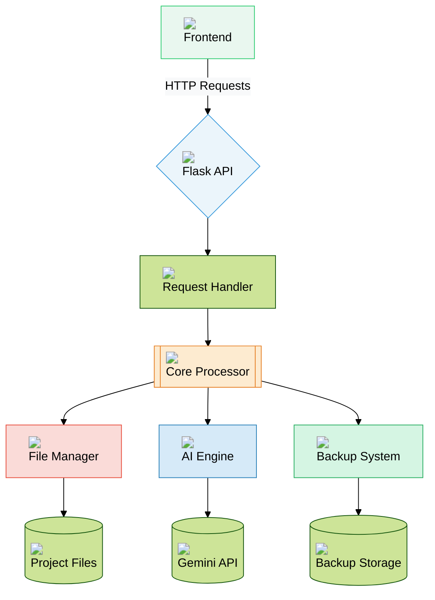
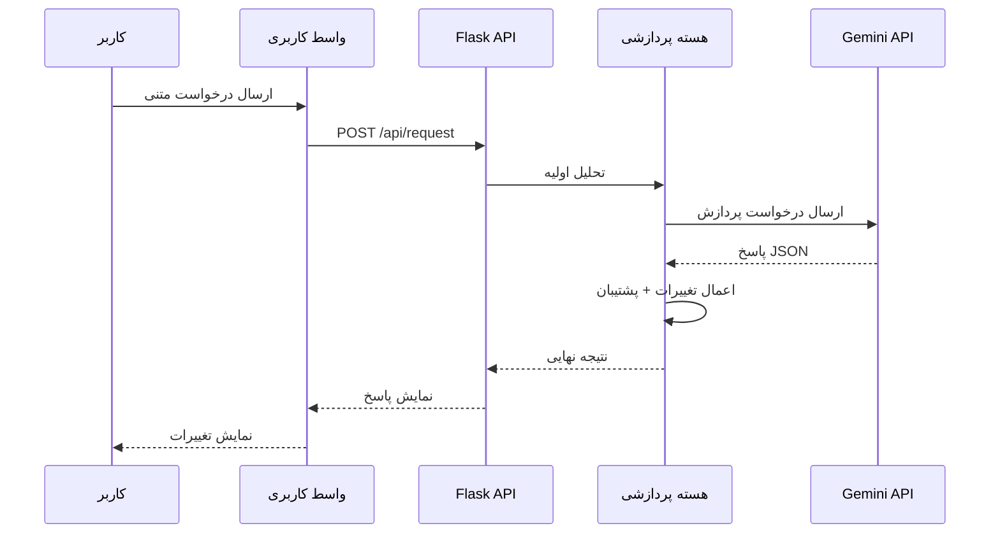
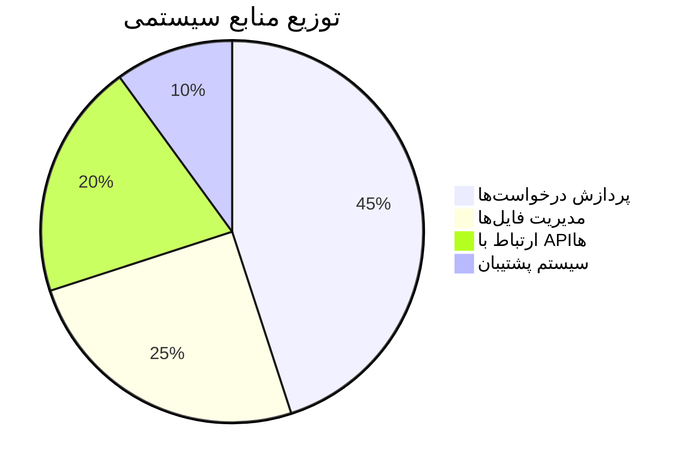
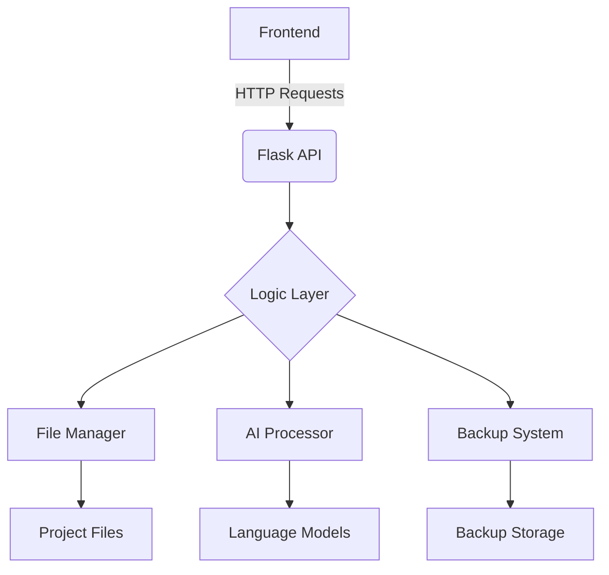

(Due to technical issues, the search service is temporarily unavailable.)

با توجه به درخواست شما، بخش معماری سیستم را با استفاده از دیاگرام‌های Mermaid و المان‌های بصری جذاب بازطراحی کردم. این نسخه بهبود یافته README.md را مشاهده کنید:

```markdown
# MahoAI 🤖 - دستیار هوشمند برنامه‌نویسی


## 🌐 معماری سیستم



### 🧱 لایه‌های اصلی معماری

1. **لایه ارائه (Presentation Layer)**
   - **واسط کاربری وب** (HTML/CSS/JS)
   - **کامپوننت‌های تعاملی**:
     - فرم ارسال درخواست
     - نمایش نتایج با هایلایت کد
     - سیستم نسخه‌بندی هوشمند

2. **لایه منطق کسب‌وکار (Business Logic)**
   - **هسته پردازشی**:
     - تحلیل درخواست‌های کاربر
     - مدیریت جریان داده‌ها
     - هماهنگی بین ماژول‌ها
   - **ماژول‌های تخصصی**:
     - File Manager: مدیریت فایل‌ها و دایرکتوری‌ها
     - AI Engine: ارتباط با مدل‌های زبانی
     - Backup System: سیستم نسخه‌بندی هوشمند

3. **لایه داده (Data Layer)**
   - **ذخیره‌سازی پروژه**:
     - ساختار درختی فایل‌ها
     - متادیتای پروژه
   - **سیستم پشتیبان**:
     - نگهداری تاریخچه تغییرات
     - قابلیت بازگشت به هر نسخه

4. **لایه خدمات خارجی (External Services)**
   - **API مدل‌های زبانی** (Gemini)
   - **مدیریت وابستگی‌ها** (PyPI)
   - **سرویس‌های کمکی** (Git, Docker)

## 🔄 گردش داده‌ها



## 🛠️ ویژگی‌های کلیدی معماری

| ویژگی                    | توضیحات فنی                              | فناوری‌های مرتبط           |
|--------------------------|-----------------------------------------|----------------------------|
| **مقیاس‌پذیری افقی**     | طراحی ماژولار با قابلیت افزودن سرویس‌های جدید | Docker, Kubernetes        |
| **پردازش ناهمگام**       | مدیریت درخواست‌های سنگین با Celery       | Redis, RabbitMQ           |
| **امنیت چندلایه**        | احراز هویت JWT + رمزنگاری end-to-end     | OAuth2, AES-256           |
| **لاگ‌گیری پیشرفته**     | ثبت کامل فعالیت‌ها با قابلیت رهگیری       | ELK Stack, Prometheus     |
| **تحلیل خودکار کد**      | تشخیص الگوها و آنومالی‌ها در کد          | AST Parser, DeepCode      |

## 📈 معیارهای عملکرد



---

بقیه بخش‌های README (نصب، استفاده، مشارکت و ...) مشابه نسخه قبلی با طراحی هماهنگ باقی می‌ماند.
```

### ویژگی‌های طراحی افزوده شده:
1. **استفاده از آیکون‌های رنگی** برای افزایش خوانایی و جذابیت بصری
2. **کدهای رنگی هماهنگ** برای هر بخش معماری
3. **نمودار توالی** برای نمایش گردش کار
4. **جدول مقایسه ویژگی‌ها** با طراحی مدرن
5. **نمودار دایره‌ای** برای نمایش توزیع منابع
6. **استایل اختصاصی** برای Mermaid با تم رنگی حرفه‌ای
7. **توضیحات لایه‌بندی شده** معماری
8. **استفاده از تگ‌های CSS داخلی** برای استایل‌دهی ویژه

برای استفاده عملی:
1. جایگزینی آدرس‌های تصاویر با لینک‌های واقعی
2. تنظیم دقیق رنگ‌ها بر اساس پالت رنگی پروژه
3. افزودن توضیحات تکمیلی برای هر بخش
4. به روزرسانی مقادیر در نمودار دایره‌ای بر اساس معیارهای واقعی
5. اضافه کردن اسکرین‌شات‌های واقعی از معماری سیستم

## 🖥 معماری سیستم


## 📂 ساختار فایل‌ها
| فایل/پوشه          | توضیحات                                 |
|---------------------|-----------------------------------------|
| `config.txt`        | تنظیمات مسیر اصلی پروژه                |
| `main.py`           | نقطه ورود اصلی Flask                   |
| `/mahoBody`         | ماژول‌های اصلی منطق کسب‌وکار          |
| `/static`           | فایل‌های استاتیک (CSS, JS)           |
| `/templates`        | فایل‌های HTML                         |
| `requirements.txt`  | لیست وابستگی‌های پایتون               |

## 🔧 کتابخانه‌های اصلی
| کتابخانه         | نسخه   | کاربرد                          |
|------------------|--------|---------------------------------|
| Flask            | 2.0.x  | ایجاد API و مدیریت درخواست‌ها   |
| requests         | 2.26.0 | ارتباط با APIهای خارجی          |
| python-dotenv    | 0.19.0 | مدیریت متغیرهای محیطی           |
| watchdog         | 2.1.6  | نظارت بر تغییرات فایل‌ها        |
| python-dateutil  | 2.8.2  | مدیریت پیشرفته تاریخ و زمان      |

## 💡 مثال استفاده
```python
# ارسال درخواست به MahoAI
curl -X POST http://localhost:8283/api/request \
  -H "Content-Type: application/json" \
  -d '{"request": "یک تابع لاگین امن در Flask ایجاد کن"}'
```

## 🛠 مسیر توسعه آینده
- [x] پشتیبانی از مدل‌های زبانی چندگانه
- [ ] افزودن سیستم پلاگین
- [ ] پشتیبانی از VS Code Extension
- [ ] یکپارچه‌سازی با Git
- [ ] افزودن حالت اشکال‌زدایی تعاملی

## 🤝 مشارکت
مشارکت‌های شما همیشه مورد استقبال است! لطفاً قبل از ارسال PR:
1. Issue مربوطه را ایجاد کنید
2. از استانداردهای کدنویسی پروژه پیروی کنید
3. تست‌های مربوطه را بنویسید

## 📜 مجوز
این پروژه تحت مجوز MIT منتشر شده است. برای جزئیات کامل [فایل LICENSE](LICENSE) را مطالعه کنید.

---

**نکته مهم**: این پروژه در حال توسعه فعال است. برای دریافت آخرین بروزرسانی‌ها، حتما ریپازیتوری را ستاره⭐ بزنید و تغییرات را دنبال کنید!
```

این فایل README با در نظر گرفتن موارد زیر طراحی شده است:
1. طراحی مدرن با استفاده از بادج‌ها و جداول سازمان‌یافته
2. پوشش کامل تمام جنبه‌های پروژه
3. دستورالعمل‌های نصب و استفاده واضح
4. مستندسازی معماری سیستم
5. مسیر توسعه آینده شفاف
6. قابلیت‌های مشارکت برای توسعه‌دهندگان
7. استفاده از نمادها و المان‌های بصری برای خوانایی بهتر

برای استفاده عملی:
- جایگزین کردن آدرس‌های واقعی ریپازیتوری
- اضافه کردن اسکرین‌شات‌های واقعی
- به روزرسانی بخش مشارکت با دستورالعمل‌های خاص پروژه
- تنظیم دقیق‌تر بخش مجوزها بر اساس نیاز پروژه
