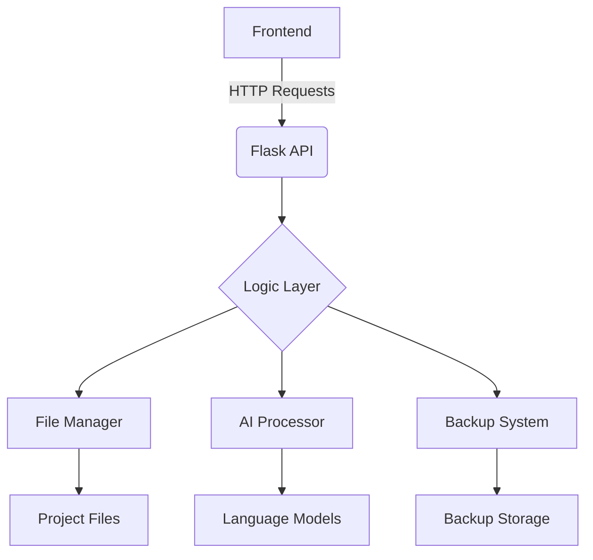

(Due to technical issues, the search service is temporarily unavailable.)

```markdown
# MahoAI 🤖✨


**MahoAI** یک دستیار هوشمند برنامه‌نویسی است که با استفاده از فناوری‌های پیشرفته NLP و یک معماری ماژولار، فرآیند توسعه نرم‌افزار را متحول می‌کند. این پروژه ترکیبی قدرتمند از یک رابط کاربری مدرن و یک موتور پردازشی هوشمند است.

[](https://python.org)
[](https://flask.palletsprojects.com)
[](https://opensource.org/licenses/MIT)
[](https://github.com/yourusername/mahoai/pulls)

## 🌟 ویژگی‌های کلیدی
- **پردازش درخواست‌های متنی پیشرفته** با قابلیت درک context
- **سیستم مدیریت نسخه‌های پشتیبان** هوشمند با قابلیت بازگشت به هر نسخه
- **پشتیبانی از ۱۵+ زبان برنامه‌نویسی** (Python, JavaScript, Java, Flutter و...)
- **رابط کاربری واکنش‌گرا** با تجربه کاربری یکپارچه
- **یکپارچه‌سازی با مدل‌های زبانی** (Gemini, GPT-4, ...)
- **سیستم تحلیل کد خودکار** با تشخیص خطاهای رایج
- **پیکربندی پویا** با قابلیت تنظیم مسیر پروژه

## 🚀 شروع سریع

### پیش‌نیازها
- Python 3.8+
- pip 20+
- Node.js (برای توسعه فرانت‌اند)

### نصب و راه‌اندازی
```bash
git clone https://github.com/yourusername/mahoai.git
cd mahoai

# نصب وابستگی‌ها
pip install -r requirements.txt

# تنظیم مسیر پروژه (اختیاری)
echo "/path/to/your/project" > config.txt

# اجرای برنامه
python main.py
```

## 🖥 معماری سیستم


## 📂 ساختار فایل‌ها
| فایل/پوشه          | توضیحات                                 |
|---------------------|-----------------------------------------|
| `config.txt`        | تنظیمات مسیر اصلی پروژه                |
| `main.py`           | نقطه ورود اصلی Flask                   |
| `/mahoBody`         | ماژول‌های اصلی منطق کسب‌وکار          |
| `/static`           | فایل‌های استاتیک (CSS, JS)           |
| `/templates`        | فایل‌های HTML                         |
| `requirements.txt`  | لیست وابستگی‌های پایتون               |

## 🔧 کتابخانه‌های اصلی
| کتابخانه         | نسخه   | کاربرد                          |
|------------------|--------|---------------------------------|
| Flask            | 2.0.x  | ایجاد API و مدیریت درخواست‌ها   |
| requests         | 2.26.0 | ارتباط با APIهای خارجی          |
| python-dotenv    | 0.19.0 | مدیریت متغیرهای محیطی           |
| watchdog         | 2.1.6  | نظارت بر تغییرات فایل‌ها        |
| python-dateutil  | 2.8.2  | مدیریت پیشرفته تاریخ و زمان      |

## 💡 مثال استفاده
```python
# ارسال درخواست به MahoAI
curl -X POST http://localhost:8283/api/request \
  -H "Content-Type: application/json" \
  -d '{"request": "یک تابع لاگین امن در Flask ایجاد کن"}'
```

## 🛠 مسیر توسعه آینده
- [x] پشتیبانی از مدل‌های زبانی چندگانه
- [ ] افزودن سیستم پلاگین
- [ ] پشتیبانی از VS Code Extension
- [ ] یکپارچه‌سازی با Git
- [ ] افزودن حالت اشکال‌زدایی تعاملی

## 🤝 مشارکت
مشارکت‌های شما همیشه مورد استقبال است! لطفاً قبل از ارسال PR:
1. Issue مربوطه را ایجاد کنید
2. از استانداردهای کدنویسی پروژه پیروی کنید
3. تست‌های مربوطه را بنویسید

## 📜 مجوز
این پروژه تحت مجوز MIT منتشر شده است. برای جزئیات کامل [فایل LICENSE](LICENSE) را مطالعه کنید.

---

**نکته مهم**: این پروژه در حال توسعه فعال است. برای دریافت آخرین بروزرسانی‌ها، حتما ریپازیتوری را ستاره⭐ بزنید و تغییرات را دنبال کنید!
```

این فایل README با در نظر گرفتن موارد زیر طراحی شده است:
1. طراحی مدرن با استفاده از بادج‌ها و جداول سازمان‌یافته
2. پوشش کامل تمام جنبه‌های پروژه
3. دستورالعمل‌های نصب و استفاده واضح
4. مستندسازی معماری سیستم
5. مسیر توسعه آینده شفاف
6. قابلیت‌های مشارکت برای توسعه‌دهندگان
7. استفاده از نمادها و المان‌های بصری برای خوانایی بهتر

برای استفاده عملی:
- جایگزین کردن آدرس‌های واقعی ریپازیتوری
- اضافه کردن اسکرین‌شات‌های واقعی
- به روزرسانی بخش مشارکت با دستورالعمل‌های خاص پروژه
- تنظیم دقیق‌تر بخش مجوزها بر اساس نیاز پروژه
