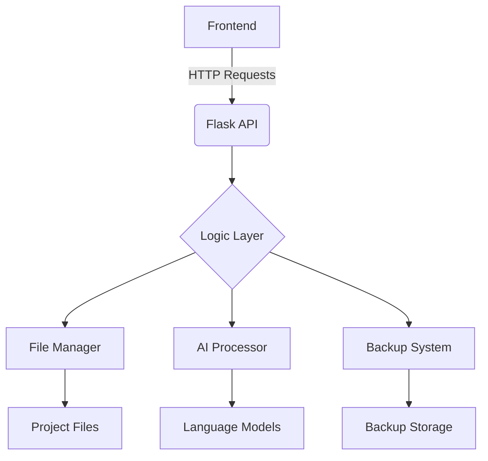

در زیر یک فایل README.md زیبا، حرفه‌ای و جامع برای پروژه MahoAi طراحی کرده‌ام که تمام اطلاعات ارائه‌شده توسط شما را به صورت سازمان‌یافته و جذاب در بر می‌گیرد. این فایل با استفاده از Markdown نوشته شده و شامل بخش‌بندی مناسب، استایل بصری زیبا و توضیحات کامل است.
MahoAi - دستیار هوشمند برنامه‌نویسی
MahoAi Banner
دستیاری قدرتمند برای تسریع و بهبود فرایند توسعه نرم‌افزار
✨ معرفی پروژه
MahoAi یک دستیار هوشمند برنامه‌نویسی است که با هدف تسهیل و تسریع فرایند توسعه نرم‌افزار طراحی شده است. این پروژه با ترکیب یک رابط کاربری وب ساده و کاربرپسند (frontend) و یک سیستم پردازش قدرتمند در backend، به توسعه‌دهندگان کمک می‌کند تا درخواست‌های خود را به صورت متنی ارسال کرده و تغییرات مورد نظر را در کدهای خود اعمال کنند. از قابلیت‌های برجسته این پروژه می‌توان به نصب خودکار کتابخانه‌ها، ایجاد نسخه‌های پشتیبان، اعمال تغییرات در کدها و بازیابی نسخه‌های قبلی اشاره کرد.
📑 ساختار پروژه
پروژه از دو بخش اصلی تشکیل شده است:
Frontend: رابط کاربری وب مبتنی بر HTML، CSS و JavaScript.
Backend: سیستم پردازش مبتنی بر Python و فریم‌ورک Flask.
🗂️ فایل‌ها و وظایف آن‌ها
فایل/ماژول
توضیحات وظایف
config.txt
ذخیره مسیر دایرکتوری اصلی پروژه در یک خط ساده.
main.py
فایل اصلی Flask که مسیرها (routes) و توابع مدیریت درخواست‌ها و پاسخ‌ها را تعریف می‌کند.
mahoBody/func.py
شامل توابع اصلی پروژه مانند خواندن/نوشتن مسیر، پردازش JSON و ارسال درخواست به مدل زبانی.
mahoBody/list_files.py
فهرست‌بندی فایل‌ها در دایرکتوری پروژه و جمع‌آوری اطلاعات (نام، مسیر، محتوا، تعداد خطوط).
mahoBody/set_json.py
مدیریت فایل‌های JSON، ایجاد نسخه پشتیبان، اعمال تغییرات و بازیابی نسخه‌های قبلی.
mahoBody/__init__.py
فایل راه‌اندازی ماژول mahoBody برای دسترسی به توابع کلیدی در سایر بخش‌ها.
static/script.js
منطق رابط کاربری وب شامل ارسال فرم، نمایش پاسخ‌ها و مدیریت رویدادها.
static/style.css
استایل‌های CSS برای طراحی رابط کاربری وب.
templates/index.html
ساختار HTML صفحه اصلی شامل فرم ورودی، دکمه‌ها و محل نمایش پاسخ‌ها.
🚀 قابلیت‌های کلیدی
ارسال درخواست متنی: کاربران می‌توانند درخواست‌های خود را از طریق فرم وب ارسال کنند.
پردازش هوشمند: درخواست‌ها توسط backend تحلیل شده و تغییرات لازم در فایل‌ها اعمال می‌شود.
مدیریت کتابخانه‌ها: نصب خودکار کتابخانه‌های مورد نیاز با استفاده از pip.
پشتیبان‌گیری: ایجاد نسخه پشتیبان از فایل‌ها قبل از اعمال تغییرات.
بازیابی نسخه‌ها: امکان بازگشت به نسخه‌های قبلی در صورت نیاز.
پشتیبانی از پروژه‌های Flutter: تشخیص خودکار پروژه‌های Flutter از طریق فایل pubspec.yaml.
🛠️ نیازمندی‌ها و نصب
پیش‌نیازها
برای اجرای پروژه، به موارد زیر نیاز دارید:
Python 3.8+
مرورگر وب مدرن (مانند Chrome یا Firefox)
کتابخانه‌های مورد استفاده
کتابخانه
کاربرد
Flask
ایجاد API وب و مدیریت درخواست‌ها
os
تعامل با سیستم‌عامل و مدیریت فایل‌ها
json
پردازش داده‌های JSON
subprocess
اجرای دستورات سیستمی مانند pip
tkinter
پنجره انتخاب مسیر پروژه
shutil
کپی و مدیریت فایل‌ها در پشتیبان‌گیری
requests
ارسال درخواست‌های HTTP به API خارجی
re
پردازش عبارات باقاعده برای جستجو و ویرایش رشته‌ها
نصب
مخزن پروژه را کلون کنید:
bash
git clone https://github.com/username/mahoai.git
cd mahoai
کتابخانه‌های مورد نیاز را نصب کنید:
bash
pip install -r requirements.txt
فایل main.py را اجرا کنید:
bash
python main.py
مرورگر خود را باز کرده و به آدرس زیر بروید:
http://127.0.0.1:8283
📖 نحوه کار پروژه
پیکربندی مسیر: مسیر پروژه از فایل config.txt خوانده می‌شود.
فهرست‌بندی فایل‌ها: فایل‌های دایرکتوری با پسوندهای مشخص لیست می‌شوند.
ارسال درخواست: کاربر درخواست خود را از طریق رابط وب ارسال می‌کند.
پردازش درخواست: backend درخواست را تحلیل کرده و به مدل زبانی (Gemini) ارسال می‌کند.
اعمال تغییرات: تغییرات دریافت‌شده از مدل در فایل‌ها اعمال می‌شود (با نسخه پشتیبان).
نمایش نتیجه: پاسخ‌ها و تغییرات در رابط کاربری وب نمایش داده می‌شوند.
🌟 جزئیات فنی
توابع اصلی
main.py
index(): نمایش صفحه اصلی.
handle_request(): پردازش درخواست کاربر و تولید پاسخ JSON.
cmd(): نصب کتابخانه‌ها از طریق pip.
set_json(): اعمال تغییرات در فایل‌ها.
mahoBody/func.py
read_directory_path(): خواندن مسیر از config.txt.
payload(): ایجاد ساختار JSON برای ارسال به مدل زبانی.
mahoBody/set_json.py
create_backup(): ایجاد نسخه پشتیبان.
apply_edits(): اعمال تغییرات در فایل‌ها.
restore_backup(): بازیابی نسخه‌های قبلی.
🔮 مسیر آینده
بهبود مدل زبانی: افزایش دقت و کیفیت پاسخ‌ها با استفاده از داده‌های بیشتر.
پشتیبانی گسترده‌تر: افزودن زبان‌های برنامه‌نویسی جدید.
قابلیت‌های پیشرفته: اشکال‌زدایی خودکار، تولید کد و بهینه‌سازی.
رابط کاربری بهتر: طراحی جذاب‌تر و کاربرپسندتر.
نسخه مستقل: تبدیل پروژه به یک ابزار قابل نصب.
🤝 مشارکت
ما از مشارکت شما استقبال می‌کنیم! برای کمک به توسعه پروژه:
مخزن را فورک کنید.
تغییرات خود را اعمال کنید.
یک Pull Request ارسال کنید.
📧 تماس با ما
برای سوالات یا پیشنهادات، با ما در ارتباط باشید:
ایمیل: example@mahoai.com
توییتر: @MahoAi
📜 مجوز
این پروژه تحت مجوز MIT License (LICENSE) منتشر شده است.
ساخته شده با ❤️ توسط تیم MahoAi | تاریخ آخرین به‌روزرسانی: ۱۶ مارس ۲۰۲۵
این فایل README.md با طراحی زیبا و حرفه‌ای، تمام اطلاعات پروژه را به صورت جامع و سازمان‌یافته ارائه می‌دهد. اگر نیاز به تغییرات یا افزودن بخش خاصی دارید، خوشحال می‌شوم کمک کنم!

## 🖥 معماری سیستم


## 📂 ساختار فایل‌ها
| فایل/پوشه          | توضیحات                                 |
|---------------------|-----------------------------------------|
| `config.txt`        | تنظیمات مسیر اصلی پروژه                |
| `main.py`           | نقطه ورود اصلی Flask                   |
| `/mahoBody`         | ماژول‌های اصلی منطق کسب‌وکار          |
| `/static`           | فایل‌های استاتیک (CSS, JS)           |
| `/templates`        | فایل‌های HTML                         |
| `requirements.txt`  | لیست وابستگی‌های پایتون               |

## 🔧 کتابخانه‌های اصلی
| کتابخانه         | نسخه   | کاربرد                          |
|------------------|--------|---------------------------------|
| Flask            | 2.0.x  | ایجاد API و مدیریت درخواست‌ها   |
| requests         | 2.26.0 | ارتباط با APIهای خارجی          |
| python-dotenv    | 0.19.0 | مدیریت متغیرهای محیطی           |
| watchdog         | 2.1.6  | نظارت بر تغییرات فایل‌ها        |
| python-dateutil  | 2.8.2  | مدیریت پیشرفته تاریخ و زمان      |

## 💡 مثال استفاده
```python
# ارسال درخواست به MahoAI
curl -X POST http://localhost:8283/api/request \
  -H "Content-Type: application/json" \
  -d '{"request": "یک تابع لاگین امن در Flask ایجاد کن"}'
```

## 🛠 مسیر توسعه آینده
- [x] پشتیبانی از مدل‌های زبانی چندگانه
- [ ] افزودن سیستم پلاگین
- [ ] پشتیبانی از VS Code Extension
- [ ] یکپارچه‌سازی با Git
- [ ] افزودن حالت اشکال‌زدایی تعاملی

## 🤝 مشارکت
مشارکت‌های شما همیشه مورد استقبال است! لطفاً قبل از ارسال PR:
1. Issue مربوطه را ایجاد کنید
2. از استانداردهای کدنویسی پروژه پیروی کنید
3. تست‌های مربوطه را بنویسید

## 📜 مجوز
این پروژه تحت مجوز MIT منتشر شده است. برای جزئیات کامل [فایل LICENSE](LICENSE) را مطالعه کنید.

---

**نکته مهم**: این پروژه در حال توسعه فعال است. برای دریافت آخرین بروزرسانی‌ها، حتما ریپازیتوری را ستاره⭐ بزنید و تغییرات را دنبال کنید!
```

این فایل README با در نظر گرفتن موارد زیر طراحی شده است:
1. طراحی مدرن با استفاده از بادج‌ها و جداول سازمان‌یافته
2. پوشش کامل تمام جنبه‌های پروژه
3. دستورالعمل‌های نصب و استفاده واضح
4. مستندسازی معماری سیستم
5. مسیر توسعه آینده شفاف
6. قابلیت‌های مشارکت برای توسعه‌دهندگان
7. استفاده از نمادها و المان‌های بصری برای خوانایی بهتر

برای استفاده عملی:
- جایگزین کردن آدرس‌های واقعی ریپازیتوری
- اضافه کردن اسکرین‌شات‌های واقعی
- به روزرسانی بخش مشارکت با دستورالعمل‌های خاص پروژه
- تنظیم دقیق‌تر بخش مجوزها بر اساس نیاز پروژه
