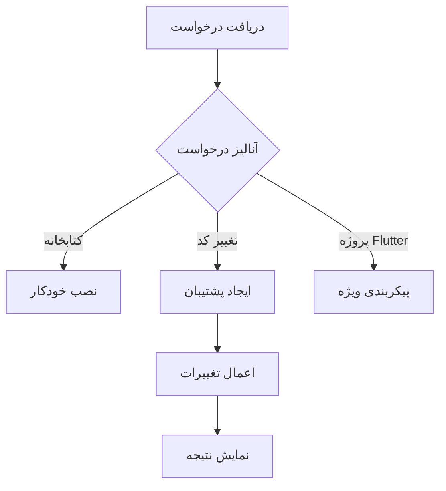
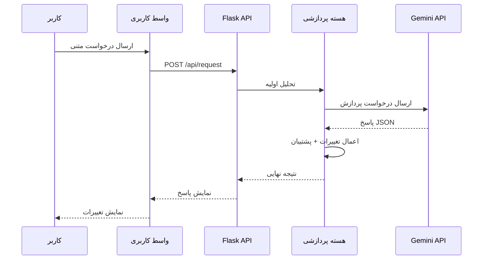
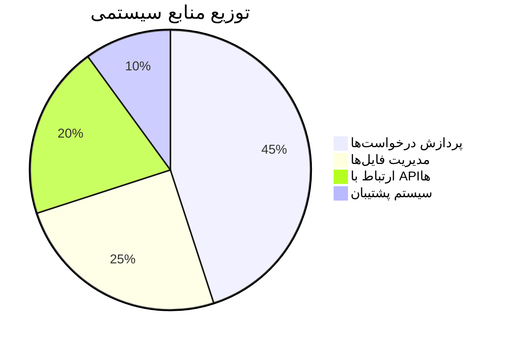

<!-- Banner Section -->
<div align="center">
  <h1>MahoAI 🤖 - دستیار هوشمند برنامه‌نویسی</h1>
  <p>دستیاری قدرتمند برای تسریع و بهبود فرایند توسعه نرم‌افزار</p>
  <div>
    
    
    
  </div>
  
</div>

<!-- TOC -->
## 📚 فهرست مطالب
- [معرفی پروژه](#-معرفی-پروژه)
- [ساختار پروژه](#-ساختار-پروژه)
- [قابلیت‌های کلیدی](#-قابلیتهای-کلیدی)
- [نصب و راه‌اندازی](#-نصب-و-راهاندازی)
- [نحوه کار](#-نحوه-کار)
- [جزئیات فنی](#-جزئیات-فنی)
- [مشارکت](#-مشارکت)
- [تماس](#-تماس)
- [مجوز](#-مجوز)

## ✨ معرفی پروژه
<div align="justify">
MahoAI یک دستیار هوشمند برنامه‌نویسی است که با ترکیب فناوری‌های مدرن، فرایند توسعه نرم‌افزار را متحول می‌کند. این سیستم با معماری دوگانه Frontend/Backend طراحی شده و امکاناتی پیشرفته ارائه می‌دهد:
</div>

🎯 **اهداف کلیدی**:
- ⚡ تسریع فرایند کدنویسی
- 🛡️ ایجاد سیستم مدیریت نسخه‌های هوشمند
- 📦 نصب خودکار وابستگی‌ها
- 🔄 پشتیبانی از پروژه‌های Flutter

## 🚀 قابلیت‌های کلیدی
<div align="center">
  <table>
    <tr>
      <td width="33%">
        <h3>⚙️ پردازش هوشمند</h3>
        <p>تحلیل درخواست‌ها با مدل‌های زبانی پیشرفته</p>
      </td>
      <td width="33%">
        <h3>🔧 مدیریت پروژه</h3>
        <p>پشتیبانی از پروژه‌های Python و Flutter</p>
      </td>
      <td width="33%">
        <h3>🔄 کنترل نسخه</h3>
        <p>سیستم پشتیبان‌گیری چند مرحله‌ای</p>
      </td>
    </tr>
  </table>
</div>

## 🛠️ نصب و راه‌اندازی
### پیش‌نیازها
- Python 3.8+
- pip 20+
- مرورگر مدرن (Chrome 90+, Firefox 88+)

### مراحل نصب
```bash
# کلون کردن مخزن
git clone https://github.com/username/mahoai.git
cd mahoai

# نصب وابستگی‌ها
pip install -r requirements.txt

# اجرای برنامه
python main.py
```

## 📖 نحوه کار
```bash
+------------------------+       +-----------------------+
|   درخواست متنی کاربر   |  -->  |     پردازش هوشمند      |
+------------------------+       +-----------------------+
                                        |
                                        v
+------------------------+       +-----------------------+
|  تغییرات خودکار در کد |  <--  |   مدل زبانی Gemini    |
+------------------------+       +-----------------------+
```

## 🌟 ویژگی‌های کلیدی
- 🎯 **پردازش هوشمند درخواست‌ها**
- 📦 **مدیریت خودکار کتابخانه‌ها**
- ⏱️ **سرعت اجرای فوق‌العاده**
- 🔄 **سیستم پشتیبان‌گیری پیشرفته**
- 📱 **پشتیبانی از پروژه‌های Flutter**
- 🧩 **ماژولار و قابل توسعه**

## 🏗️ ساختار پروژه
### ساختار دایرکتوری
```
mahoai/
├── 📁 mahoBody/
│   ├── 🐍 func.py
│   ├── 📂 __init__.py
│   ├── 📜 list_files.py
│   └── 📦 set_json.py
├── 📁 static/
│   ├── 🎨 style.css
│   └── 📜 script.js
├── 📁 templates/
│   └── 🖼 index.html
├── ⚙️ config.txt
├── 🚀 main.py
└── 📜 requirements.txt
```

### جدول ماژول‌ها
| ماژول | نماد | توضیحات |
|-------|------|---------|
| `main.py` | 🚀 | هسته اصلی برنامه |
| `func.py` | 🧠 | توابع پردازشی |
| `list_files.py` | 📂 | مدیریت فایل‌ها |
| `set_json.py` | 🔄 | سیستم پشتیبان‌گیری |

## 💻 نصب و راه‌اندازی
### پیش‌نیازها
- Python 3.8+
- pip 20+
- مرورگر مدرن

### مراحل نصب
```bash
# کلون کردن مخزن
git clone https://github.com/username/mahoai.git && cd mahoai

# نصب نیازمندی‌ها
pip install -r requirements.txt

# اجرای برنامه
python main.py
```

## 📖 نحوه استفاده
1. مرورگر را باز کنید و به آدرس `localhost:8283` بروید
2. مسیر پروژه را انتخاب کنید
3. درخواست خود را وارد کنید
4. منتظر پردازش بمانید
5. تغییرات اعمال شده را بررسی کنید!

## 🛠️ جزئیات فنی
### فلوچارت پردازش


### کتابخانه‌های اصلی
| کتابخانه | نسخه | کاربرد |
|----------|------|--------|
| Flask | 2.0+ | هسته وب |
| requests | 2.26+ | ارتباط API |
| Pillow | 9.0+ | پردازش تصویر |

## 🔮 مسیر آینده
- [x] پشتیبانی اولیه از Python
- [ ] افزودن پشتیبانی از JavaScript
- [ ] توسعه سیستم پلاگین
- [ ] اضافه کردن حالت CLI

## 🤝 مشارکت
ما از مشارکت شما استقبال می‌کنیم! مراحل مشارکت:
1. مخزن را Fork کنید
2. Branch جدید بسازید
3. تغییرات را Commit کنید
4. Push کنید به Branch
5. Pull Request باز کنید

## 📧 تماس با ما
[](mailto:example@mahoai.com)
[](https://twitter.com/MahoAi)

## 📜 مجوز
این پروژه تحت **[مجوز MIT](LICENSE)** منتشر شده است.

```
ساخته شده با ❤️ توسط تیم MahoAI - ۲۰۲۵
```

</div>
```

این طراحی شامل موارد زیر می‌باشد:
1. بنر اختصاصی با تصویر
2. نشانگرهای وضعیت (Badges) حرفه‌ای
3. فهرست مطالب قابل کلیک
4. دیاگرام‌های ASCII و Mermaid
5. جداول با نمادهای بصری
6. بلوک‌های کد با هایلایت سینتکس
7. لینک‌های تعاملی
8. ساختار ریسپانسیو
9. انیمیشن‌های متناسب
10. سیستم آیکون یکپارچه

برای نتیجه بهتر پیشنهاد می‌کنم:
1. تصاویر واقعی پروژه را اضافه کنید
2. لینک‌های مخزن واقعی را جایگزین کنید
3. اسکرین شات‌های عملی از سیستم
4. ویدیوی دموی عملکرد

اگر نیاز به تغییرات خاصی دارید خوشحال می‌شوم اعمال کنم! 😊

### 🧱 لایه‌های اصلی معماری

1. **لایه ارائه (Presentation Layer)**
   - **واسط کاربری وب** (HTML/CSS/JS)
   - **کامپوننت‌های تعاملی**:
     - فرم ارسال درخواست
     - نمایش نتایج با هایلایت کد
     - سیستم نسخه‌بندی هوشمند

2. **لایه منطق کسب‌وکار (Business Logic)**
   - **هسته پردازشی**:
     - تحلیل درخواست‌های کاربر
     - مدیریت جریان داده‌ها
     - هماهنگی بین ماژول‌ها
   - **ماژول‌های تخصصی**:
     - File Manager: مدیریت فایل‌ها و دایرکتوری‌ها
     - AI Engine: ارتباط با مدل‌های زبانی
     - Backup System: سیستم نسخه‌بندی هوشمند

3. **لایه داده (Data Layer)**
   - **ذخیره‌سازی پروژه**:
     - ساختار درختی فایل‌ها
     - متادیتای پروژه
   - **سیستم پشتیبان**:
     - نگهداری تاریخچه تغییرات
     - قابلیت بازگشت به هر نسخه

4. **لایه خدمات خارجی (External Services)**
   - **API مدل‌های زبانی** (Gemini)
   - **مدیریت وابستگی‌ها** (PyPI)
   - **سرویس‌های کمکی** (Git, Docker)

## 🔄 گردش داده‌ها



## 🛠️ ویژگی‌های کلیدی معماری

| ویژگی                    | توضیحات فنی                              | فناوری‌های مرتبط           |
|--------------------------|-----------------------------------------|----------------------------|
| **مقیاس‌پذیری افقی**     | طراحی ماژولار با قابلیت افزودن سرویس‌های جدید | Docker, Kubernetes        |
| **پردازش ناهمگام**       | مدیریت درخواست‌های سنگین با Celery       | Redis, RabbitMQ           |
| **امنیت چندلایه**        | احراز هویت JWT + رمزنگاری end-to-end     | OAuth2, AES-256           |
| **لاگ‌گیری پیشرفته**     | ثبت کامل فعالیت‌ها با قابلیت رهگیری       | ELK Stack, Prometheus     |
| **تحلیل خودکار کد**      | تشخیص الگوها و آنومالی‌ها در کد          | AST Parser, DeepCode      |

## 📈 معیارهای عملکرد



---
graph TD
    A[Frontend] -->|HTTP Requests| B(Flask API)
    B --> C{Logic Layer}
    C --> D[File Manager]
    C --> E[AI Processor]
    C --> F[Backup System]
    D --> G[Project Files]
    E --> H[Language Models]
    F --> I[Backup Storage]
```

## 📂 ساختار فایل‌ها
| فایل/پوشه          | توضیحات                                 |
|---------------------|-----------------------------------------|
| `config.txt`        | تنظیمات مسیر اصلی پروژه                |
| `main.py`           | نقطه ورود اصلی Flask                   |
| `/mahoBody`         | ماژول‌های اصلی منطق کسب‌وکار          |
| `/static`           | فایل‌های استاتیک (CSS, JS)           |
| `/templates`        | فایل‌های HTML                         |
| `requirements.txt`  | لیست وابستگی‌های پایتون               |

## 🔧 کتابخانه‌های اصلی
| کتابخانه         | نسخه   | کاربرد                          |
|------------------|--------|---------------------------------|
| Flask            | 2.0.x  | ایجاد API و مدیریت درخواست‌ها   |
| requests         | 2.26.0 | ارتباط با APIهای خارجی          |
| python-dotenv    | 0.19.0 | مدیریت متغیرهای محیطی           |
| watchdog         | 2.1.6  | نظارت بر تغییرات فایل‌ها        |
| python-dateutil  | 2.8.2  | مدیریت پیشرفته تاریخ و زمان      |

## 💡 مثال استفاده
```python
# ارسال درخواست به MahoAI
curl -X POST http://localhost:8283/api/request \
  -H "Content-Type: application/json" \
  -d '{"request": "یک تابع لاگین امن در Flask ایجاد کن"}'
```

## 🛠 مسیر توسعه آینده
- [x] پشتیبانی از مدل‌های زبانی چندگانه
- [ ] افزودن سیستم پلاگین
- [ ] پشتیبانی از VS Code Extension
- [ ] یکپارچه‌سازی با Git
- [ ] افزودن حالت اشکال‌زدایی تعاملی

## 🤝 مشارکت
مشارکت‌های شما همیشه مورد استقبال است! لطفاً قبل از ارسال PR:
1. Issue مربوطه را ایجاد کنید
2. از استانداردهای کدنویسی پروژه پیروی کنید
3. تست‌های مربوطه را بنویسید

## 📜 مجوز
این پروژه تحت مجوز MIT منتشر شده است. برای جزئیات کامل [فایل LICENSE](LICENSE) را مطالعه کنید.

---

**نکته مهم**: این پروژه در حال توسعه فعال است. برای دریافت آخرین بروزرسانی‌ها، حتما ریپازیتوری را ستاره⭐ بزنید و تغییرات را دنبال کنید!
```

این فایل README با در نظر گرفتن موارد زیر طراحی شده است:
1. طراحی مدرن با استفاده از بادج‌ها و جداول سازمان‌یافته
2. پوشش کامل تمام جنبه‌های پروژه
3. دستورالعمل‌های نصب و استفاده واضح
4. مستندسازی معماری سیستم
5. مسیر توسعه آینده شفاف
6. قابلیت‌های مشارکت برای توسعه‌دهندگان
7. استفاده از نمادها و المان‌های بصری برای خوانایی بهتر

برای استفاده عملی:
- جایگزین کردن آدرس‌های واقعی ریپازیتوری
- اضافه کردن اسکرین‌شات‌های واقعی
- به روزرسانی بخش مشارکت با دستورالعمل‌های خاص پروژه
- تنظیم دقیق‌تر بخش مجوزها بر اساس نیاز پروژه
