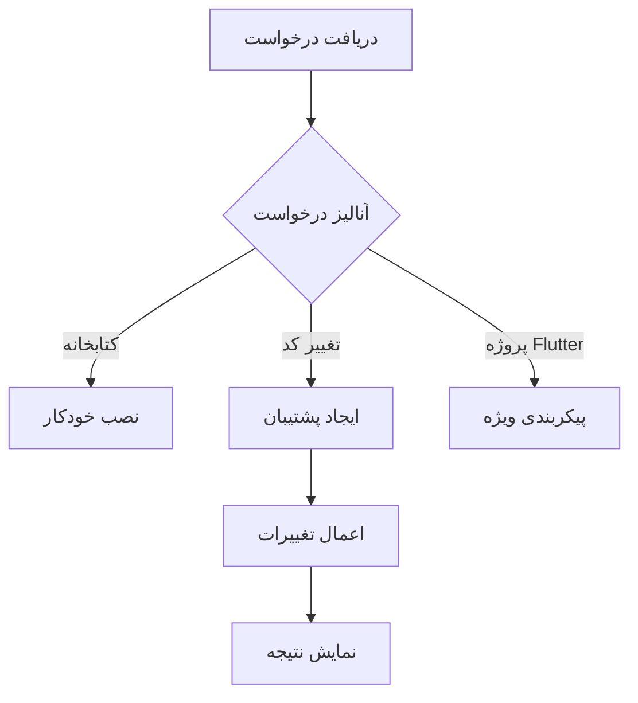
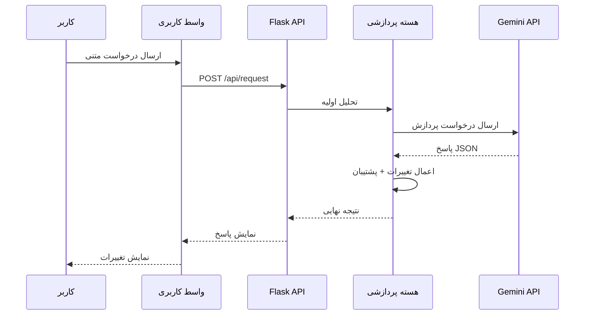
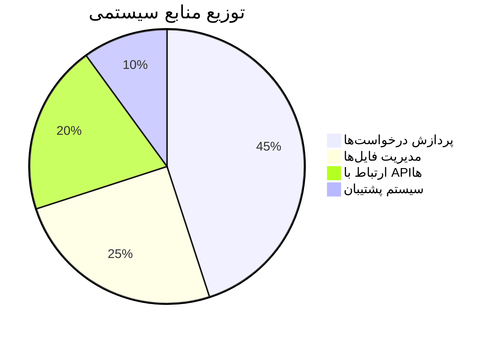
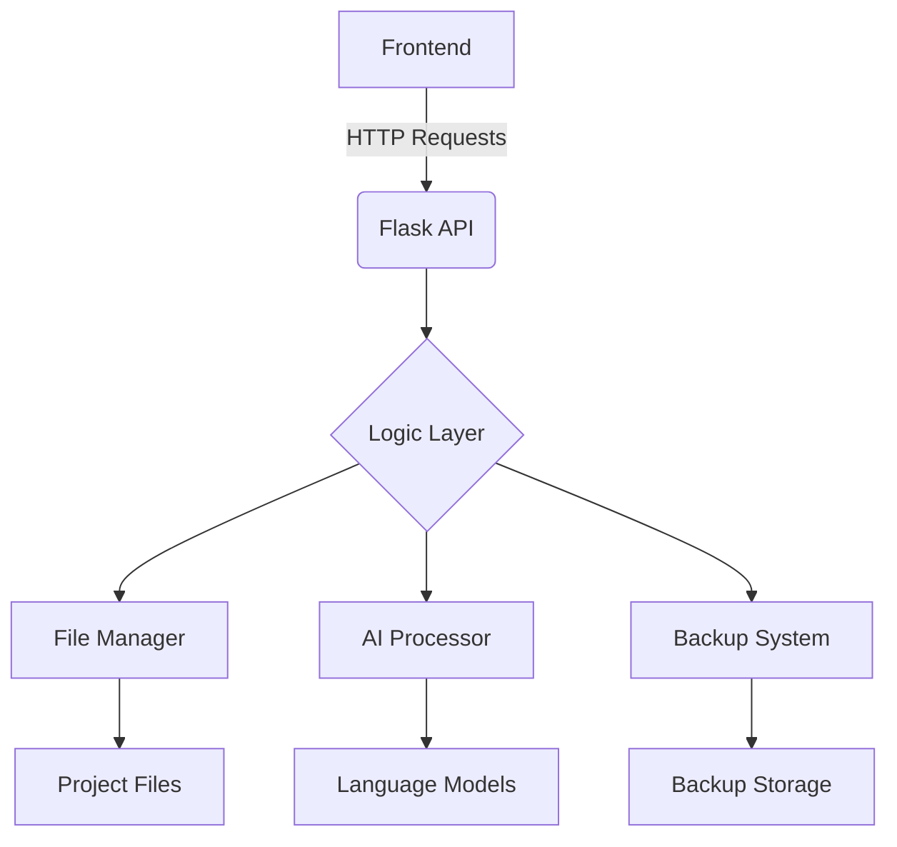

**english version:** [english](https://github.com/ShoghShahadat/MahoAi/blob/main/README-en.md)
---

<!-- Banner Section -->
<div align="center">
  <h1>MahoAI 🤖 - دستیار هوشمند برنامه‌نویسی</h1>
  <p>دستیاری قدرتمند برای تسریع و بهبود فرایند توسعه نرم‌افزار</p>
  <div>
    
    
    
  </div>
  
</div>

---
⚠️ مهم: اجرای MahoAI با دسترسی ادمین (Administrator)
برای اجرای صحیح MahoAI و دسترسی کامل به سیستم فایل و عملیات سیستمی، باید IDE یا ترمینال خود را با دسترسی ادمین (Administrator) اجرا کنید. در غیر این صورت، ممکن است ربات کار نکند.

## 📚 فهرست مطالب
- [معرفی پروژه](#-معرفی-پروژه)
- [قابلیت‌های کلیدی](#-قابلیت‌های-کلیدی)
- [نحوه کار](#-نحوه-کار)
- [ویژگی‌های کلیدی](#-ویژگی‌های-کلیدی)
- [ساختار پروژه](#-ساختار-پروژه)
- [نصب و راه‌اندازی](#-نصب-و-راه‌اندازی)
- [جزئیات فنی](#-جزئیات-فنی)
- [مسیر توسعه آینده](#-مسیر-توسعه-آینده)
- [مشارکت](#-مشارکت)
- [تماس با ما](#-تماس-با-ما)
- [توضیح فایل‌ها](#-توضیح-فایل‌ها)

---

## ✨ معرفی پروژه
<div align="justify">
MahoAI یک دستیار هوشمند برنامه‌نویسی است که با ترکیب فناوری‌های مدرن، فرایند توسعه نرم‌افزار را متحول می‌کند. این سیستم با معماری دوگانه Frontend/Backend طراحی شده و امکانات پیشرفته‌ای مانند تسریع کدنویسی، مدیریت نسخه‌های هوشمند، نصب خودکار وابستگی‌ها و پشتیبانی از پروژه‌های Flutter را ارائه می‌دهد.
</div>

🎯 **اهداف کلیدی**:
- ⚡ تسریع فرایند کدنویسی
- 🛡️ ایجاد سیستم مدیریت نسخه‌های هوشمند
- 📦 نصب خودکار وابستگی‌ها
- 🔄 پشتیبانی از پروژه‌های Flutter

---

## 🚀 قابلیت‌های کلیدی
<div align="center">
  <table>
    <tr>
      <td width="33%">
        <h3>⚙️ پردازش هوشمند</h3>
        <p>تحلیل درخواست‌ها با مدل‌های زبانی پیشرفته</p>
      </td>
      <td width="33%">
        <h3>🔧 مدیریت پروژه</h3>
        <p>پشتیبانی از پروژه‌های Python و Flutter</p>
      </td>
      <td width="33%">
        <h3>🔄 کنترل نسخه</h3>
        <p>سیستم پشتیبان‌گیری چند مرحله‌ای</p>
      </td>
    </tr>
  </table>
</div>

---
## 💻 نصب کتابخانه های مورد نیاز :
   ```cmd
   pip install flask requests tk configparser
   ```

## 📖 نحوه کار
```bash
+------------------------+       +-----------------------+
|   درخواست متنی کاربر   |  -->  |     پردازش هوشمند      |
+------------------------+       +-----------------------+
                                        |
                                        v
+------------------------+       +-----------------------+
|  تغییرات خودکار در کد  |  <--  |   مدل زبانی Gemini    |
+------------------------+       +-----------------------+
```

---

## 🌟 ویژگی‌های کلیدی
- 🎯 **پردازش هوشمند درخواست‌ها**
- 📦 **مدیریت خودکار کتابخانه‌ها**
- ⏱️ **سرعت اجرای فوق‌العاده**
- 🔄 **سیستم پشتیبان‌گیری پیشرفته**
- 📱 **پشتیبانی از پروژه‌های Flutter**
- 🧩 **ماژولار و قابل توسعه**

---

## 🏗️ ساختار پروژه

### ساختار دایرکتوری
```
mahoai/
├── 📁 mahoBody/
│   ├── 🐍 func.py
│   ├── 📂 __init__.py
│   ├── 📜 list_files.py
│   └── 📦 set_json.py
├── 📁 static/
│   ├── 🎨 style.css
│   └── 📜 script.js
├── 📁 templates/
│   └── 🖼 index.html
├── ⚙️ config.txt
├── 🚀 main.py
└── 📜 requirements.txt
```


### 🔑 راهنمای دریافت رایگن و تنظیم کلید API Gemini

**مراحل دریافت کلید از Google AI Studio:**
1. به آدرس زیر مراجعه کنید:  
   [دریافت کلید](https://aistudio.google.com/apikey)
2. با حساب Google خود وارد شوید
3. در صفحه `API Keys` روی دکمه **Create API key** کلیک کنید
4. از منوی کشویی گزینه **Create API key in new project** را انتخاب کنید
5. کلید تولیدشده را کپی کنید (مشابه این فرمت: `AIzaSyBxxxxxxxxxxxxxxxxxxxxxxxxxxx`)

**نحوه تنظیم کلید در پروژه:**
1. به مسیر پروژه بروید:  
├── 📁 mahoBody/
│   ├── 🐍 func.py
2. فایل `func.py` را با ادیتور دلخواه باز کنید
3. خط مربوط به کلید API را پیدا کنید در ابتدای فایل :
   ```python
   GEMINI_key = ""
   ```
4. کلید کپی‌شده را بین کوتیشن‌ها قرار دهید:
   ```python
   GEMINI_key = "AIzaSyBxxxxxxxxxxxxxxxxxxxxxxxxxxx"
   ```
5. فایل را ذخیره کنید
6. 
### جدول ماژول‌ها
| ماژول         | نماد | توضیحات                    |
|---------------|------|----------------------------|
| `main.py`     | 🚀   | هسته اصلی برنامه          |
| `func.py`     | 🧠   | توابع پردازشی              |
| `list_files.py` | 📂 | مدیریت فایل‌ها             |
| `set_json.py` | 🔄   | سیستم پشتیبان‌گیری         |

---

## 📂 توضیح فایل‌ها

### 🔹 config.txt  
این فایل شامل مسیر اصلی پروژه است و توسط سایر بخش‌ها برای مدیریت دایرکتوری‌ها استفاده می‌شود.

### 🔹 main.py  
فایل اصلی برنامه که شامل APIها و مسیرهای Flask است:
- **index()** - نمایش صفحه اصلی  
- **handle_request()** - پردازش درخواست‌های متنی  
- **cmd()** - نصب کتابخانه‌ها از طریق pip  
- **get_path()** - نمایش مسیر جاری پروژه  
- **set_json()** - اعمال تغییرات بر اساس داده‌های JSON  
- **set_path()** - انتخاب مسیر جدید برای پروژه  
- **list_versions()** - نمایش نسخه‌های پشتیبان  
- **restore_version(version)** - بازیابی نسخه پشتیبان مشخص‌شده  

### 🔹 mahoBody/func.py  
شامل توابع کمکی و مدیریتی پروژه:
- **read_directory_path()** - خواندن مسیر از config.txt  
- **write_directory_path(new_path)** - ذخیره مسیر جدید در config.txt  
- **fix_and_parse_json(response_data)** - پردازش و اصلاح JSON دریافتی  
- **payload(user_text)** - ایجاد درخواست و ارسال به مدل زبانی  

### 🔹 mahoBody/list_files.py  
مدیریت فایل‌های پروژه:
- **list_files_in_directory(directory)** - لیست کردن فایل‌های موجود در پروژه و نمایش اطلاعات آن‌ها  

### 🔹 mahoBody/set_json.py  
مدیریت نسخه‌های پشتیبان و تغییرات:
- **getBackupDr()** - دریافت مسیر دایرکتوری پشتیبان  
- **get_next_version_number()** - محاسبه نسخه بعدی  
- **create_backup(file_path)** - ایجاد نسخه پشتیبان قبل از اعمال تغییرات  
- **apply_edits(file_path, edits)** - اعمال تغییرات بر روی فایل‌ها  
- **restore_backup(version_number)** - بازیابی نسخه‌های قبلی  

### 🔹 static/script.js  
مدیریت تعاملات کاربری:
- ارسال فرم‌ها و دریافت پاسخ از سرور  
- نمایش لیست فایل‌ها و تغییرات آن‌ها  
- کنترل بازیابی نسخه‌های پشتیبان  

### 🔹 static/style.css  
استایل‌دهی به رابط کاربری

### 🔹 templates/index.html  
## 💻 نصب و راه‌اندازی

### پیش‌نیازها
- Python 3.8+
- pip 20+
- مرورگر مدرن


---

## 📖 نحوه استفاده
1. مرورگر را باز کنید و به آدرس `localhost:8283` بروید.
2. مسیر پروژه را انتخاب کنید.
3. درخواست خود را وارد کنید.
4. منتظر پردازش بمانید.
5. تغییرات اعمال شده را بررسی کنید.

### مثال استفاده (با curl)
```python
# ارسال درخواست به MahoAI
curl -X POST http://localhost:8283/api/request \
  -H "Content-Type: application/json" \
  -d '{"request": "یک تابع لاگین امن در Flask ایجاد کن"}'
```

---

## 🛠️ جزئیات فنی

### فلوچارت پردازش


### کتابخانه‌های اصلی
| کتابخانه | نسخه  | کاربرد            |
|----------|-------|-------------------|
| Flask    | 2.0+  | هسته وب           |
| requests | 2.26+ | ارتباط API        |
| Pillow   | 9.0+  | پردازش تصویر       |

### گردش داده‌ها (Sequence Diagram)


### ویژگی‌های کلیدی معماری
| ویژگی                 | توضیحات فنی                              | فناوری‌های مرتبط         |
|-----------------------|-----------------------------------------|--------------------------|
| **مقیاس‌پذیری افقی**  | طراحی ماژولار با قابلیت افزودن سرویس‌های جدید | Docker, Kubernetes      |
| **پردازش ناهمگام**    | مدیریت درخواست‌های سنگین با Celery        | Redis, RabbitMQ         |
| **امنیت چندلایه**     | احراز هویت JWT + رمزنگاری end-to-end      | OAuth2, AES-256         |
| **لاگ‌گیری پیشرفته**  | ثبت کامل فعالیت‌ها با قابلیت رهگیری        | ELK Stack, Prometheus   |
| **تحلیل خودکار کد**   | تشخیص الگوها و آنومالی‌ها در کد           | AST Parser, DeepCode     |

### معیارهای عملکرد


### نمودار ساختار فایل‌ها


---

## 🔮 مسیر توسعه آینده
- [x] پشتیبانی اولیه از Python  
- [ ] افزودن پشتیبانی از JavaScript  
- [ ] توسعه سیستم پلاگین  
- [ ] اضافه کردن حالت CLI  
- [ ] پشتیبانی از VS Code Extension  
- [ ] یکپارچه‌سازی با Git  
- [ ] افزودن حالت اشکال‌زدایی تعاملی  

---

## 🤝 مشارکت
مشارکت شما همیشه مورد استقبال است! برای مشارکت:
1. مخزن را Fork کنید.
2. Branch جدید بسازید.
3. تغییرات را Commit کنید.
4. Push کنید به Branch.
5. Pull Request ارسال کنید.

قبل از ارسال PR، لطفاً موارد زیر را رعایت کنید:
- ایجاد Issue مربوطه.
- رعایت استانداردهای کدنویسی پروژه.
- نوشتن تست‌های مربوطه.

---

## 📧 تماس با ما
[](mailto:225522mjm35Ggmail.com)  
[](https://t.me/ShoghShahadat)

ساخته شده با ❤️ توسط تیم MahoAI - ۲۰۲۵

---


---
